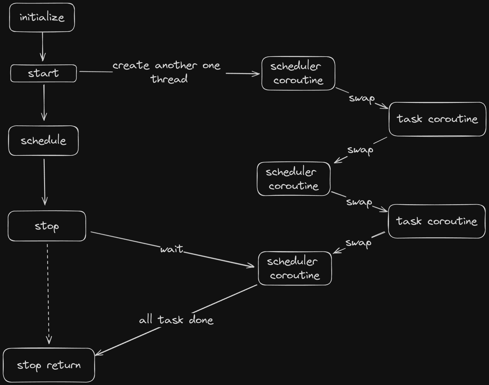
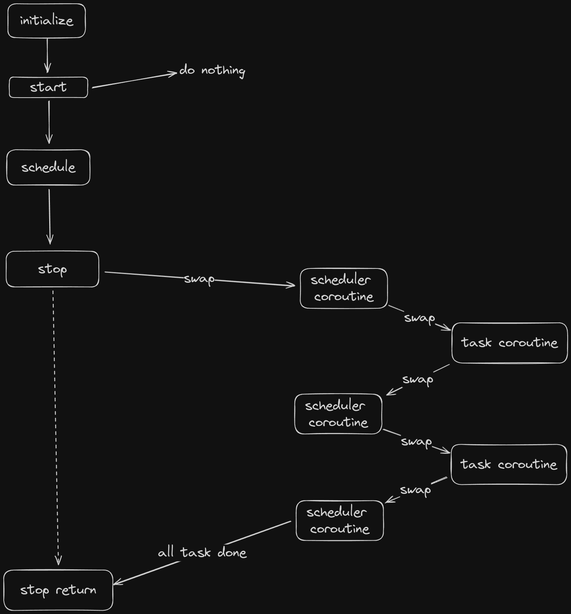

# Coroutine Module

- [Coroutine Module](#coroutine-module)
  - [Basic](#basic)
  - [The Design of Coroutine](#the-design-of-coroutine)
- [Schedule Module](#schedule-module)
  - [Two Execution Mode](#two-execution-mode)
  - [The issue of Idel](#the-issue-of-idel)


## Basic

Explanation of this main four function(excerpt from man manual):

```cpp
  int getcontext(ucontext_t *ucp);
  int setcontext(const ucontext_t *ucp);
```

In a System V-like environment, one has the two types mcontext_t and ucontext_t defined in `<ucontext.h>` and the four functions `getcontext(), setcontext(), makecontext(3), and swapcontext(3)` that allow user-level context switching between multiple threads of control within a process.

The mcontext_t type is machine-dependent and opaque.  The ucontext_t type is a structure that has at least the following fields:

```cpp
typedef struct ucontext_t {
    struct ucontext_t *uc_link;
    sigset_t          uc_sigmask;
    stack_t           uc_stack;
    mcontext_t        uc_mcontext;
    ...
} ucontext_t;
```

with `sigset_t` and `stack_t` defined in `<signal.h>`.  Here `uc_link` points to the context that will be resumed when the current context termi‐nates (in case the current context was created using `makecontext(3)`), `uc_sigmask` is the set of signals blocked in this context (see `sigprocmask(2)`), `uc_stack` is the stack used by this context (see `sigaltstack(2)`), and `uc_mcontext` is the machine-specific representation of the saved context, that includes the calling thread's machine registers.

The function `getcontext()` initializes the structure pointed at by `ucp` to the currently active context.

The function `setcontext()` restores the user context pointed at by `ucp`.  A successful call does not return.  The context should have been obtained by a call of `getcontext()`, or `makecontext(3)`, or passed as third argument to a signal handler.

If the context was obtained by a call of `getcontext()`, program execution continues as if this call just returned.

If the context was obtained by a call of `makecontext(3)`, program execution continues by a call to the function func specified as the second argument of that call to `makecontext(3)`.  When the function func returns, we continue with the `uc_link` member of the structure `ucp` specified as the first argument of that call to `makecontext(3)`.  When this member is NULL, the thread exits.

Return:

When successful, `getcontext()` returns 0 and `setcontext()` does not
return. On error, both return -1 and set errno appropriately.

---

```cpp
void makecontext(ucontext_t *ucp, void (*func)(), int argc, ...);
int swapcontext(ucontext_t *restrict oucp, const ucontext_t *restrict ucp);
```

In a System V-like environment, one has the type `ucontext_t` (defined in `<ucontext.h>` and described in `getcontext(3)`) and the four functions `getcontext(3), setcontext(3), makecontext(), and swapcontext()` that allow user-level context switching between multiple threads of control within a process.

The `makecontext()` function modifies the context pointed to by `ucp` (which was obtained from a call to `getcontext(3)`).  Before invoking `makecontext()`, the caller must allocate a new stack for this context and assign its address to `ucp->uc_stack`, and define a successor context and assign its address to `ucp->uc_link`.

When this context is later activated (using `setcontext(3) or swapcontext()`) the function `func` is called, and passed the series of integer (int) arguments that follow argc; the caller must specify the number of these arguments in `argc`.  When this function returns, the successor context is activated. If the successor context pointer is NULL, the thread exits.

The `swapcontext()` function saves the current context in the structure pointed to by `oucp`, and then activates the context pointed to by `ucp`. 

Return:

When successful, `swapcontext()` does not return.  (But we may return later, in case `oucp` is activated, in which case it looks like `swapcontext()` returns 0.)  On error, swapcontext() returns -1 and sets errno to indicate the error.

Notes:

The interpretation of `ucp->uc_stack` is just as in `sigaltstack(2)`, namely, this struct contains the start and length of a memory area to be used as the stack, regardless of the direction of growth of the stack.  Thus, it is not necessary for the user program to worry about this direction.

## The Design of Coroutine

We define two static thread_local smart pointer: `t_cur_coroutine` and `t_main_coroutine`. These two pointer separately manage coroutine object, indicating two separated coroutine. When you initialize a coroutine object with parameterized constructor, that object serve as sub-coroutine and main coroutine must separately initialize in another method. So, **if we want to resume coroutine, we must call `CreateMainCo` before we resume it.**   

When we use object to call `SwapIn()` method, the execution flow will swap from main coroutine to sub-coroutine. In actuall execution, we will jump into `MainFunc` function(swap to context of `MainFunc`), the context of `obj.SwapIn()` will store in `t_main_coroutine`. 

Precisely speaking, the context of the method of initializing coroutine should treat to be main coroutine and the context of that coroutine object should treat to be sub-coroutine. 

In this design, we only support two coroutine execution and the execution of these two coroutines always in single thread, they just swap context with each other, instead of access data simutaneously, so we don't need to hold mutex.

# Schedule Module

In our coroutine module, each thread only has two static thread local variable to track two different coroutine: main coroutine and sub-coroutine. `t_main_coroutine` always points to main coroutine and `t_cur_coroutine` always points to current executing coroutine. Since when we want to resume a coroutine, we must use member metohd(that is `Resume()`), it will automatically assign pointer of current coroutine to `t_cur_coroutine`. Because of this fact, each thread only support two coroutine.

Since out coroutine besed on context swapping, if we only have one thread and want to perform many task, including function and coroutine, the execution flow of current thread must be blocked and wait all task has done. Above that, if we want to consider current thread, which is initializing scheduler, as scheduler thread, whose responsibility is initializing schedule and wait for all task, and work thread, whose responsibility is execute method or coroutine, only two pointer cannot satisfy out demand.

We introduce another pointer, called `t_global_coroutine`, to store main context(which is the execution flow of initializing scheduler). Now, if we want to treat current thread as worker thread, which will change the value of `t_cur_pointer` and `t_main_pointer`, we can still go back to main context.

## Two Execution Mode

We can chose whether use caller thread as worker thread or not, in order to simplify our discussion, we consider two scenario:

- `threads: 1, use_caller: false`
- `threads: 1, use_caller: true`

In scenario 1, we will additionally create another thread as worker thread and main thread only wait for its return, the execution flow of main thread is as follows:



In scenario 2, we will not create another thread, main thread will serve as worker thread, as follows:



## The issue of Idel

If one thread is idel, it will execute `Idel()` method, this method just yield control back to main coroutine. So in this framework, if one thread is idel, it will spin in CPU and waste CPU time.

You might say why we don't desing a sort of notify mechanism to notify sleep thread. But it will cause another issue: a thread is idel, it will sleep and wait for notifying, it's good, but if a thread is in idel, it will exit only when task arrives; if a task want to arrive, the idel should exit. It cause deathlock. 

Frankly speaking, this issue cannot be address in current framework, maybe we can think of another wat to alleviate it. In the section of IO Manager, idel thread can block in `epoll_wait` to wait for file descriptor to be "ready"(ready to read and write), which can alleviate this spin.